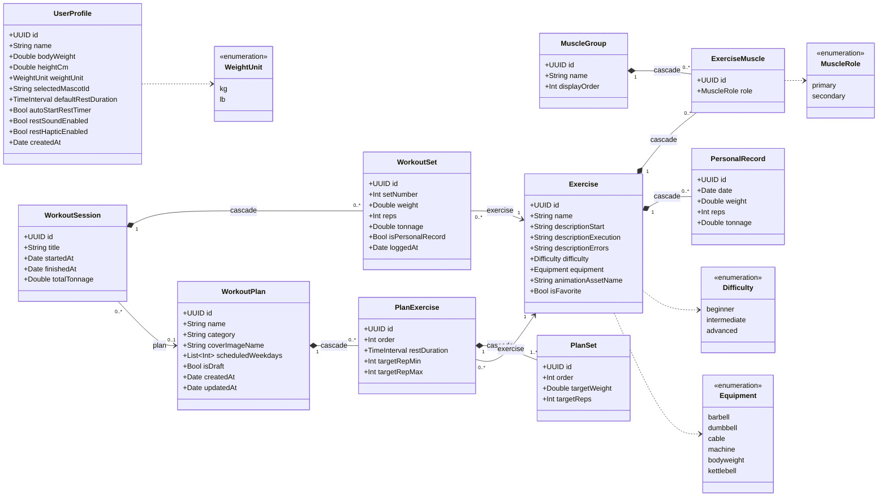

# KINETIC — SwiftData Models

Полная схема данных приложения **KINETIC**, спроектированная на основе [docs/userflow.md](userflow.md) и решений из [AGENTS.md](../AGENTS.md). Это канонический справочник по моделям; детали слоя репозиториев/DTO — в [data-layer.md](data-layer.md).

> **Конвенции**
> - Swift 6, Strict Concurrency. Все модели — `@Model final class`.
> - `id: UUID` у каждой сущности; для справочных/корневых — `@Attribute(.unique)`.
> - **Tonnage First**: `tonnage = weight × reps` денормализуется на уровне `WorkoutSet` и агрегируется в `WorkoutSession.totalTonnage`.
> - **Model-First**: любое изменение UI начинается отсюда.
> - Тексты каталога (имена/описания упражнений, мышцы) локализуются по выбранной стратегии — см. memory `project_localization_strategy`. В моделях хранятся канонические строки/ключи.
> - Связи «родитель → дети» с владением — `deleteRule: .cascade`; ссылки на справочные данные — `.nullify`.

---

## 1. Перечисления (enums)

```swift
import Foundation
import SwiftData

enum WeightUnit: String, Codable, CaseIterable {
    case kg, lb
}

enum Difficulty: String, Codable, CaseIterable {
    case beginner, intermediate, advanced
}

/// Тег оборудования (Barbell / Cable / … в Library и Exercise Detail).
enum Equipment: String, Codable, CaseIterable {
    case barbell, dumbbell, cable, machine, bodyweight, kettlebell, band, other
}

/// Роль мышцы в упражнении: первичная (lime) или вторичная.
enum MuscleRole: String, Codable {
    case primary, secondary
}
```

---

## 2. Модели

### 2.1. `UserProfile` — профиль и настройки (singleton)

Создаётся на Profile Setup; хранит данные профиля и настройки из Settings.

```swift
@Model
final class UserProfile {
    @Attribute(.unique) var id: UUID
    var name: String                       // YOUR NAME
    var bodyWeight: Double                  // в единицах weightUnit (для bodyweight-упражнений)
    var heightCm: Double?                   // профиль-карточка (опционально)
    var weightUnit: WeightUnit              // переключатель kg / lb (Settings)
    var selectedMascotId: String            // "duck" (утка) | "baklazha"; список расширяемый

    // — Настройки тренировки (Settings · TRAINING) —
    var defaultRestDuration: TimeInterval   // дефолт для новых PlanExercise.restDuration
    var autoStartRestTimer: Bool            // авто-старт отдыха после Complete Set

    // — Уведомления и фидбек (Settings · NOTIFICATIONS & FEEDBACK) —
    var restSoundEnabled: Bool              // Rest timer alerts (локальные уведомления)
    var restHapticEnabled: Bool             // Haptic feedback

    var createdAt: Date
}
```

> **Не в модели:** флаг «онбординг пройден» — это app-level состояние (`@AppStorage`/`UserDefaults`); наличие `UserProfile` сигнализирует о завершённой настройке. `level`, `email`, `telegramUserId` — на будущее (см. §6).

### 2.2. `MuscleGroup` — группа мышц

Справочные данные (сидинг). Чипы-фильтры в Library: Chest, Back, Legs, Shoulders, Arms, Core.

```swift
@Model
final class MuscleGroup {
    @Attribute(.unique) var id: UUID
    var name: String                       // "Chest", "Back", …
    var displayOrder: Int                  // порядок чипов

    @Relationship(deleteRule: .cascade, inverse: \ExerciseMuscle.muscleGroup)
    var exerciseLinks: [ExerciseMuscle]
}
```

### 2.3. `ExerciseMuscle` — связка «упражнение ↔ мышца» (join)

Явная join-сущность: в SwiftData нельзя хранить атрибут (`role`) на самой many-to-many связи, поэтому primary/secondary моделируется отдельной сущностью.

```swift
@Model
final class ExerciseMuscle {
    @Attribute(.unique) var id: UUID
    var role: MuscleRole                   // primary / secondary
    var exercise: Exercise?
    var muscleGroup: MuscleGroup?
}
```

### 2.4. `Exercise` — упражнение из каталога

```swift
@Model
final class Exercise {
    @Attribute(.unique) var id: UUID
    var name: String
    var descriptionStart: String           // SETUP — исходное положение
    var descriptionExecution: String       // EXECUTION — шаги выполнения
    var descriptionErrors: String          // COMMON MISTAKES — типичные ошибки
    var difficulty: Difficulty             // Beginner / Intermediate / Advanced
    var equipment: Equipment               // тег Barbell / Cable / …
    var animationAssetName: String?        // Lottie/.mov демо техники маскота
    var isFavorite: Bool                   // ⭐ тоггл в Exercise Detail

    @Relationship(deleteRule: .cascade, inverse: \ExerciseMuscle.exercise)
    var muscleLinks: [ExerciseMuscle]

    @Relationship(deleteRule: .cascade, inverse: \PersonalRecord.exercise)
    var personalRecords: [PersonalRecord]

    // — derived —
    var primaryMuscles: [MuscleGroup] {
        muscleLinks.filter { $0.role == .primary }.compactMap(\.muscleGroup)
    }
    var secondaryMuscles: [MuscleGroup] {
        muscleLinks.filter { $0.role == .secondary }.compactMap(\.muscleGroup)
    }
}
```

> `Est. 1RM` и `Attempts` из Exercise Detail — **не хранятся**: считаются в `AnalyticsService` (§5).

### 2.5. `PersonalRecord` — личный рекорд по упражнению

История достижений (вкладка `PRs`/`History`). Создаётся `WorkoutService`, когда подход побивает предыдущий лучший.

```swift
@Model
final class PersonalRecord {
    @Attribute(.unique) var id: UUID
    var exercise: Exercise?
    var date: Date
    var weight: Double
    var reps: Int
    var tonnage: Double                    // weight × reps (денормализовано)
}
```

### 2.6. `WorkoutPlan` — шаблон тренировки (конструктор)

```swift
@Model
final class WorkoutPlan {
    @Attribute(.unique) var id: UUID
    var name: String                       // "Push Day"
    var category: String?                  // "UPPER / PULL" (eyebrow на Dashboard hero)
    var coverImageName: String?            // hero-обложка
    var accentColorHex: String?            // опц. акцент карточки
    var scheduledWeekdays: [Int]           // 1...7 (Calendar.weekday) — week strip / Next session
    var isDraft: Bool                      // Save Draft vs Save Plan
    var createdAt: Date
    var updatedAt: Date                    // "Auto-saved · 12s ago"

    @Relationship(deleteRule: .cascade, inverse: \PlanExercise.plan)
    var planExercises: [PlanExercise]      // сортировка по PlanExercise.order

    // — derived —
    var totalSets: Int { planExercises.reduce(0) { $0 + $1.targetSets } }
    var targetMuscleGroups: [MuscleGroup] {           // из упражнений плана
        Array(Set(planExercises.compactMap(\.exercise).flatMap(\.primaryMuscles)))
    }
    // estimatedDuration — оценка в AnalyticsService (сеты × (время сета + restDuration))
}
```

### 2.7. `PlanExercise` — упражнение внутри плана

```swift
@Model
final class PlanExercise {
    @Attribute(.unique) var id: UUID
    var plan: WorkoutPlan?
    var exercise: Exercise?
    var order: Int                         // Drag & Drop сортировка
    var restDuration: TimeInterval         // "Rest between sets 02:00"
    var targetRepMin: Int                  // "8-12" → 8
    var targetRepMax: Int                  // "8-12" → 12

    @Relationship(deleteRule: .cascade, inverse: \PlanSet.planExercise)
    var planSets: [PlanSet]                // строки сетов в Builder

    var targetSets: Int { planSets.count }
}
```

### 2.8. `PlanSet` — запланированный подход в плане

Соответствует строкам таблицы сетов в Workout Builder (`SET / WEIGHT / REPS`).

```swift
@Model
final class PlanSet {
    @Attribute(.unique) var id: UUID
    var planExercise: PlanExercise?
    var order: Int                         // номер сета
    var targetWeight: Double?              // запланированный вес (может быть пустым)
    var targetReps: Int
}
```

### 2.9. `WorkoutSession` — выполненная / активная тренировка

```swift
@Model
final class WorkoutSession {
    @Attribute(.unique) var id: UUID
    var title: String                      // "Push Day · Bench focus" | "Quick Workout"
    var plan: WorkoutPlan?                 // nil для Quick Start
    var startedAt: Date
    var finishedAt: Date?                  // nil пока сессия активна
    var totalTonnage: Double               // агрегат всех sets.tonnage

    @Relationship(deleteRule: .cascade, inverse: \WorkoutSet.session)
    var sets: [WorkoutSet]

    // — derived —
    var isActive: Bool { finishedAt == nil }
    var duration: TimeInterval { (finishedAt ?? .now).timeIntervalSince(startedAt) }
    var containsPR: Bool { sets.contains(where: \.isPersonalRecord) }
}
```

### 2.10. `WorkoutSet` — один зафиксированный подход

```swift
@Model
final class WorkoutSet {
    @Attribute(.unique) var id: UUID
    var session: WorkoutSession?
    var exercise: Exercise?
    var setNumber: Int
    var weight: Double
    var reps: Int
    var tonnage: Double                    // weight × reps (денормализовано)
    var isPersonalRecord: Bool             // флаг: этот сет побил рекорд (для бейджа PR)
    var loggedAt: Date
}
```

---

## 3. Связи и правила удаления

| Родитель | Дочерняя | Кратность | Delete rule | Назначение |
| --- | --- | --- | --- | --- |
| `Exercise` | `ExerciseMuscle` | 1 → 0..* | `.cascade` | мышцы упражнения (роль primary/secondary) |
| `MuscleGroup` | `ExerciseMuscle` | 1 → 0..* | `.cascade` | обратная сторона join |
| `Exercise` | `PersonalRecord` | 1 → 0..* | `.cascade` | история рекордов |
| `WorkoutPlan` | `PlanExercise` | 1 → 0..* | `.cascade` | упражнения плана |
| `PlanExercise` | `PlanSet` | 1 → 1..* | `.cascade` | запланированные подходы |
| `WorkoutSession` | `WorkoutSet` | 1 → 0..* | `.cascade` | зафиксированные подходы |
| `PlanExercise` | `Exercise` | 0..* → 1 | `.nullify`¹ | ссылка на каталог |
| `WorkoutSet` | `Exercise` | 0..* → 1 | `.nullify`¹ | ссылка на каталог |
| `WorkoutSession` | `WorkoutPlan` | 0..* → 0..1 | `.nullify` | история не удаляется при удалении плана |

¹ Упражнения каталога — сидинговые справочные данные, удаляются редко. При удалении ссылка обнуляется; для read-only истории при необходимости можно денормализовать `exerciseName` в `WorkoutSet` (опц. упрочнение).

---

## 4. Что НЕ хранится (вычисляется)

| Значение | Где видно | Как считается |
| --- | --- | --- |
| `Est. 1RM` | Exercise Detail · PR card | формула (напр. Epley) по лучшему `PersonalRecord` |
| `Attempts` | Exercise Detail · PR card | `count(WorkoutSet where exercise == …)` |
| Total/Weekly tonnage, дельты | Dashboard, Progress | агрегаты `WorkoutSet.tonnage` по периодам (`AnalyticsService`) |
| `Streak`, `New PRs`, `Sessions`, `Time` | Progress · stats grid | по завершённым `WorkoutSession` / `PersonalRecord` за период |
| `targetMuscleGroups`, `totalSets`, `estimatedDuration` | Builder, Dashboard | из `planExercises` |
| Состояния дня (done/today/planned/rest) | Dashboard week strip | сессии за день + `WorkoutPlan.scheduledWeekdays` + календарь |

---

## 5. Сервисы (контекст использования моделей)

- **`WorkoutService`** — `startSession()` (создаёт `WorkoutSession`), `logSet()` (создаёт `WorkoutSet`, считает `tonnage`, выставляет `isPersonalRecord` и при необходимости создаёт `PersonalRecord`), `finishSession()` (проставляет `finishedAt`, агрегирует `totalTonnage`).
- **`AnalyticsService`** — тоннаж за период с дельтой, фильтрация по диапазону (Week/Month/3M/Year/All), `streak`, число новых PR, `Est. 1RM`, `Attempts`, оценка длительности плана.
- **`CSVExporter`** — экспорт истории `WorkoutSession`/`WorkoutSet` (Settings · DATA).

---

## 6. Вне области v1 (на будущее)

- **Авторизация** — вход через **Telegram ID (OAuth)**; добавит `telegramUserId` / `email` в `UserProfile`.
- **Apple Health**, **Weekly summary email**, **`level`** (геймификация) — пока не моделируем.
- **Программы/мезоциклы** («WEEK 3») — сейчас расписание задаётся `WorkoutPlan.scheduledWeekdays` (недельная повторяемость). Полноценный `Program` (недели/фазы) — отдельная итерация.

---

## 7. UML-диаграмма (Mermaid)

> Рендерится в GitHub и в VSCode-превью. Если в VSCode не видно — установи расширение **«Markdown Preview Mermaid Support»** (bierner.markdown-mermaid).


